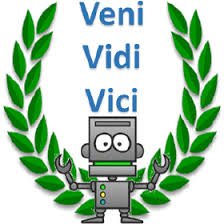
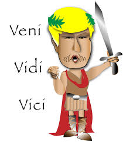
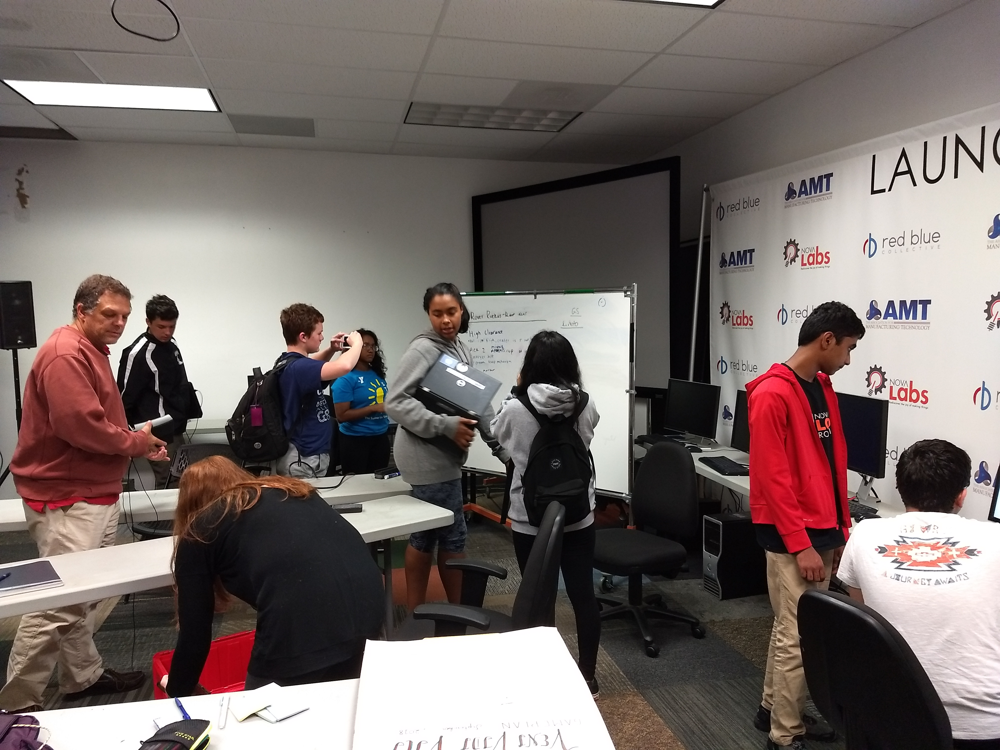

<br>


&nbsp;<span style="color:red; font-size:25px; font-weight:bold; background-color:powderblue;">
 &nbsp;&nbsp; Home of FTC Team 8535 -- NOVA LABS &nbsp; &nbsp;&nbsp;
</span>


<br>
<center>
 
</center>  

```{r temp, eval=FALSE, echo=FALSE}

"logo/favicon.ico"
"images/Saturday-9-8-2018-Manasas/IMG_20180909_1
"images/Sunday-9-9-2018-NovaLabs/IMG_20180909_140105370.jpg"
128*3
"logo/images9.jpg"

```


***

## MISSION STATEMENT

```yml

As FTC team 8535, our mission is to introduce younger kids into robotics and STEM, and create a new, STEM-loving generation to improve and explore the world.

```

***

<br>


## INDIVIDUAL BIO’s

Our group consists of a group of high schools students from the Fairfax country community.  Individual interest are alisted below:

<br>

### Anika Natarajan

```yml
Hello. My name is Anika Natarajan. I am in 8th and attend Herndon Middle School. This is my first time being part of FIRST and I am enjoying it! I am part of the build team! In my spare time,  I  love to draw landscapes  and  painting,  channeling my inner creativity.
```
<br>

### Alina Ampeh

```yml
Hi! I’m Alina Ampeh and I'm a junior at Thomas Jefferson High School for Science and Technology. I got involved with FIRST over this past summer where I mentored at FLL camps, and through that experience I decided to join a FTC team. I am on the build team and programming team, and also love to help the outreach team coordinate event. Outside of FIRST, I enjoy playing as the goalie for my school’s lacrosse team, and training my pets.
```

<br>

### Arthur Haneline

```yml
Hello. My name is Arthur Haneline and I am a Freshman at Herndon High School. I have been participating in FTC for three years and love it. I am the build captain and also part of the outreach team.  Beyond FTC, i am involved in marching band and enjoy reading!
```

<br>

### Aakash Natarajan 

```yml
Hi. My name is Aakash Natarajan. I am in 8th grade and attend Herndon Middle School. This is my first year in FTC and love it very much!  In my spare time , I focus on basketball and football. I also love to read!
```

<br>

### Shayoan Fadaghi

```yml
Hello. My name is Shayoan Fadaghi. I am a junior that goes to Pootmac Falls high school. This is my first time participating in FTC. I love being part of the build team because I get to  brainstorm innovative ideas to help build an amazing robot! Outside of FTC, I LOVE  to play video games and hangout with my school friends. 
```

<br>

### Maria Tellez

```yml
Hi there, I am Maria Tellez Casildo. I am a Freshman at Herndon High School. This is my third year of FTC. I am apart of the Engineering Notebook team, as well as the Outreach team, but I also help with the mechanical team. Apart from my passion with robotics, I am also passionate about art, eating, and soccer.
```

***

<br>

## WHAT WE DO

*FTC definition* - FTC stands for FIRST tech challenge, it is a competition where you build, design, and program a robot to overcome challenges and play against other team’s robots. The competitors are middle and high school-aged students.
Teams of middle and high school-aged


***

<br>

## GAMEPLAN 

```yml

Game plan 123 ....

```

<br>

***

## HOW TO ENROLL

> You can enroll by reaching out to us at:

>> Veni-vidi-vici<br>
>> <i>Email: <a href="mailto:ftcteam8535@gmail.com?subject=Interested in joining NovaLabs 8353!&Please respond.">ftcteam8535@gmail.com</a></i>

<br>